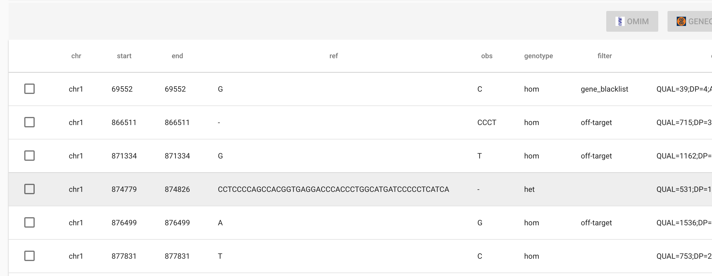

ngs-remote
----------

`ngs-remote` is a remote API and browser application for [ngs-bits](https://github.com/imgag/ngs-bits).

Currently it is capable of displaying and processing `.GSvar` files



## Architecture

`ngs-remote` consists of server API which is [specified](./swagger.yaml) and implemented with [flask](http://flask.pocoo.org) using [OpenAPI](https://www.openapis.org/). 

Installation instructions can be found in the [API folder](./api/README.md).

The following environment variables can be set during startup:

| Variable      | Meaning                                  | Default |
| ------------- |:----------------------------------------:|:-------:|
| PORT          | Which port the server should listen on   | 8080    |
| NGS_BITS_DATA | Where to put uploaded files              | $PWD    |
| NGS_BITS_BIN  | Where to find ngs bits binaries          | $PWD    |
| SERVE_DIST    | Whether the dist folder should be served | False   |

You can start the server using above variables like so:

```
PORT=9000 NGS_BITS_DATA=$PWD/data NGS_BITS_BIN=/some/path/to/ngs-bits/bin SERVE_DIST=True python3 -m swagger_server
```

You can find the Swagger UI under `/v1/ui` for testing and experiment purposes.

For convenience reasons the server also can serve files from the `dist` folder, allowing it to serve the frontend.

The API works by invoking shell pipelines and the command line interface of `ngs-bits`.

### Frontend

The frontend is a single page application built with [Vue](https://vuejs.org/) and [Vuetify](https://vuetifyjs.com/en/). Build instructions can be found in [frontend folder](./frontend/README.md).

The following environment variables can be set:

| Variable         | Meaning                           | Default                   |
| ---------------- | --------------------------------- | ------------------------- |
| VUE_APP_BASEPATH | Which URL to use for API requests | http://localhost:9000/v1/ |

You can invoke environment variables like so:

```
VUE_APP_BASEPATH=http://localhost:8000  npm run build
```

After building the project one can copy the `dist` folder into the `api` directory. When setting `SERVE_DIST`, it will be displayed as the default.

## Deployment in production

Currently `ngs-remote` has not been tested in a production environment (meaning, it has not been publicly deployed to the WWW).

It is strongly recommended to use standalone [WSGI](https://wsgi.readthedocs.io/en/latest/index.html) containers, [such as gunicorn](http://flask.pocoo.org/docs/1.0/deploying/wsgi-standalone/#gunicorn), additionally behind a proxy.
